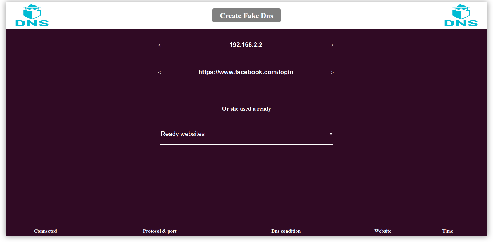
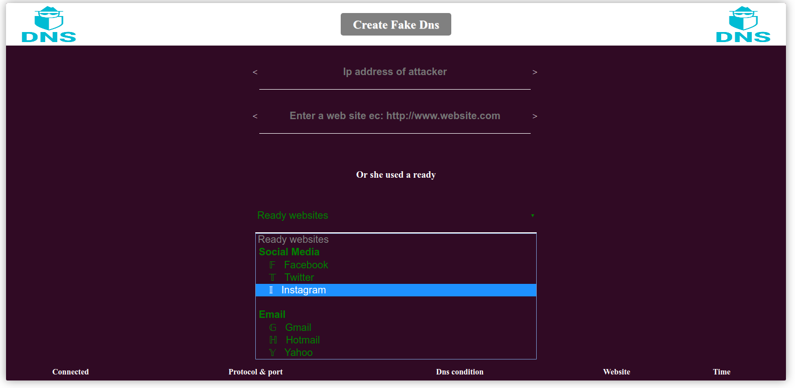
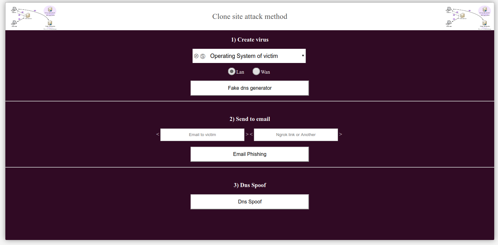
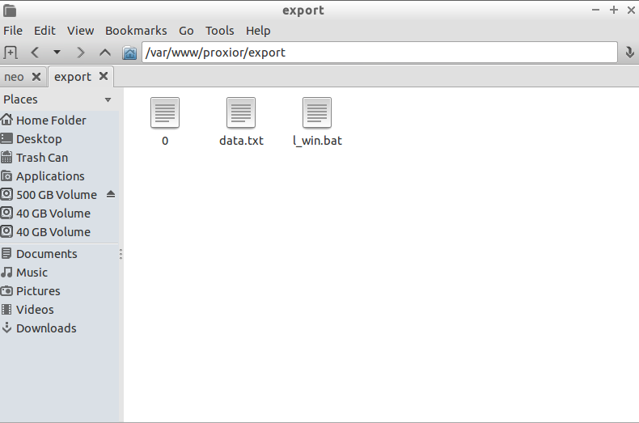
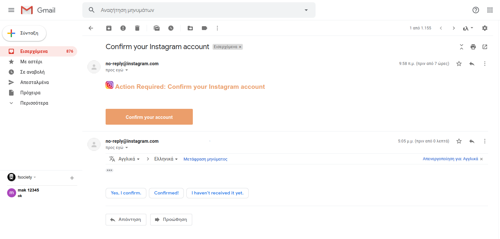
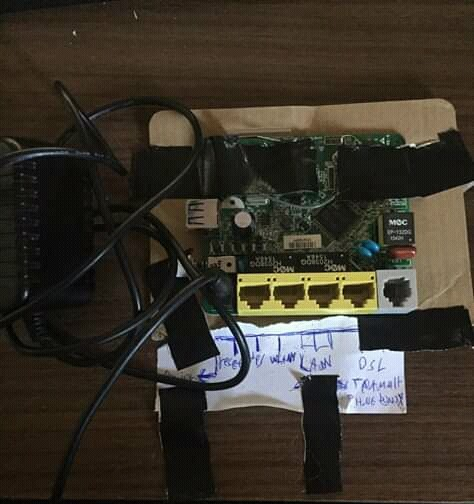
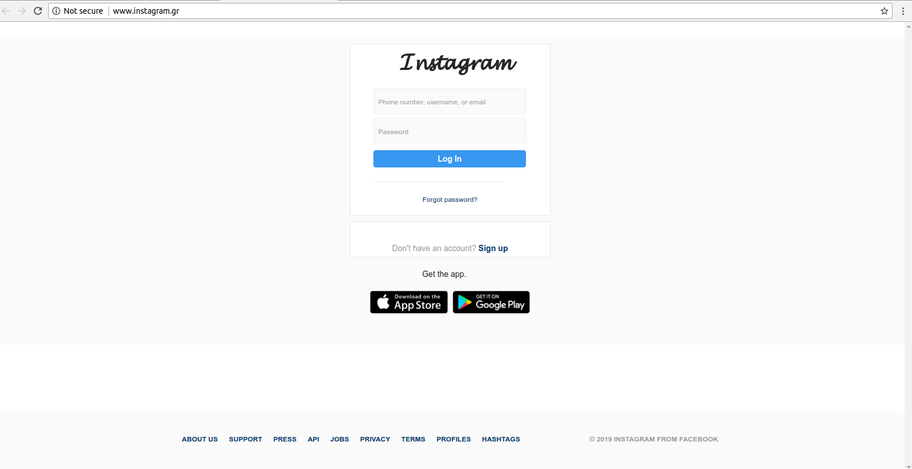
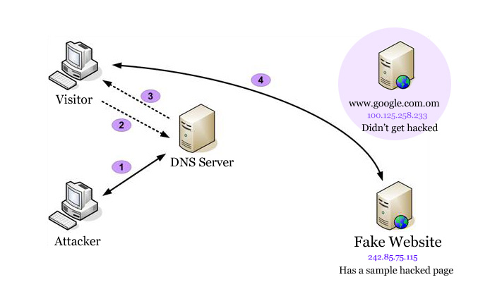

# proxior
lan and wifi interception.  
program for interception all lan and wifi traffic.  

    

   

  <b> INSTALLATION </b>   
 
 
 <table>
 
  <tr>
     <td>  </td>
  <td> System requirements (dual core and more, 2gb ram and more) </td>
   </tr>
   
  <tr>
   <td>  </td>
   <td>  OS System: (Gnu/linux systems bellow) </td>
  </tr>
  
 <tr>
  <td>  </td>
  <td> Kali Linux </td>
 </tr>
     
 <tr>
  <td>  </td>
  <td> Ubuntu </td>
 </tr>

<tr>
 <td>  </td>
 <td> Linux Mint </td>
</tr>

</table>

 i) Download the programm unzip and paste folder proxior in to /var/www/  
ii) Open the terminal and run chmod -R 777 /var/www/proxior  
iii) Open the terminal ang go to /var/www/proxior/ssl path  
     This path run the command mkcert -install  
     After install run the this comand for create ssl keys for lan network   
      (This ssl keys stop all https connections in aln for (emails and social media) services  
      (Only http services worked in the lan)  
      (The ssl keys are ready for proxior default)  
      (if you want created new keys for block new https services view the filw "use" into ssl folder)  
      (example for create ssl keys:) mkcert proxiorkeys gmail.com "*.gmail.com" "*.hotmail.com" "*.yahoo.com" "*.twitter.com" "*.facebook.com" "*.instagram.com" localhost 127.0.0.1 ::1 192.168.2.2  
v) after replace the file lines /etc/apach2/sites-available/default-ssl.conf with them  
  
   
    <IfModule mod_ssl.c>  
     <VirtualHost _default_:443>  
        ServerAdmin admin@proxior.gr  
        ServerName proxior.gr    
        ServerAlias www.proxior.gr   
        DocumentRoot /var/www/proxior   
        ErrorLog ${APACHE_LOG_DIR}/error.log  
        CustomLog ${APACHE_LOG_DIR}/access.log combined  
        SSLEngine on   
        SSLCertificateFile /var/www/proxior/ssl/proxiorkeys+10.pem  
        SSLCertificateKeyFile /var/www/proxior/ssl/proxiorkeys+10-key.pem  
    <Directory /var/www/proxior>  
    Options Indexes FollowSymLinks MultiViews ExecCGI  
    AllowOverride None  
    Order allow,deny   
    allow from all     
    </Directory>  
        BrowserMatch "MSIE [2-6]" \  
                        nokeepalive ssl-unclean-shutdown \  
                        downgrade-1.0 force-response-1.0  
        BrowserMatch "MSIE [17-9]" ssl-unclean-shutdown  
    </VirtualHost>  
    </IfModule>  

    

vi) Turn on the device and connect it to your computer via a LAN or Wi-Fi cable  
vii) Proxior is ready to use.  

This program have   

i) Any website clone for manual method  

  a) insert the ip of attacker  
  b) insert a name of a web site and press enter  
  c) The web site it must have http or https protocol  
     Right: http://www.example.com or http://example.com  
     Wrong: www.example.com or example.com  
     
    

 ii) Ready web sites (social media and email)  
 
 a) social media (facebook,instagram,twitter)  
 b) email (gmail,hotmail,yahoo)  

    

Three attack methods  

    

a) Fake dns generator for create batch file for computer of victim  
   To find the batch file go to /export/l_win.bat     

    

b) Email phishing with ngrok link  
 After install the ngrok in same folder  
 Install ngrok from here https://ngrok.com/  
 Run th script and clone any website    
 
 !Notice.. For using email phishing method open the file settings.txt  
 Insert the details your account email (need a email account for send fake emails)  
 e.x  
 email@gmail.com  
 password123456   
 Default seetings working for gmail accounts. If you want using another mail change the mail settings from file settings.txt  
 #settings for email server informations  
 debug: 0  
 authentication: true  
 tls or ssl: tls  
 host: smtp.gmail.com  
 port: 465 or 587   
 
    

 
c) Dns Spoof (Spoofing and poisoning DNS with hardware device)  
   For this method insert in to device the the dns for spoof  
   For your ip view in to the connection informations or enter ifconfig on terminal  
   For first operation and second operation your use the ip from eth0  
   For third operation roque wifi use the ip from wlan0 
   e.x  
   dns: www.gmail.com  
   ip: 192.168.2.2  
   
   This device username and password details.  
   username: proxior  
   password: proxior  
   
   For create new fake dns follow this steps  
   Insert into device: getaway: 192.168.2.1 username: proxior pass: proxior   
   Go to Application -> DNS Service -> Host  
   Insert into Host Name field the dns for spoof e.x www.instagram.gr  
   Insert into IP Address field the ip from your server e.x 192.168.2.2  
   Press add. Dns spoof registered    
   
     
      
      
       

   
   You can use this device for three operations  
   
   First operation is router. Connect to dsl cable in to dsl port in device  
   
   Second operqtion is acces point with cable. Connect lan port from device with lan port yo router  
   After disable dchp server form device and give ip = 192.168.2.253 and subnet mask = 255.255.255.0  
   
   Third operation is created a roque wifi with no internet connection  
   !Attention! The wifi must be open... NO KEYS NO ENCRYPTION..... FREE WIFI    
   
   For create new attack method or create new atack for begin with different site   
   Go to UI panel.. your_ip/UI.. e.x 192.168.2.2/UI  
   UI Login credentials. username: proxior@dns and password: proxior@dns  
   Presse clear in UI panel. Now proxior delete all data and start from begin    
 
   
   For view steal accounts go to UI panel  
   Go to UI.. your_ip/UI..  e.x 192.168.2.2/UI  
   For save steal accounts press save from UI panel  
   Save steal accounts in text files in to "stored" folder  
   
       

  

   How it works

   

 
